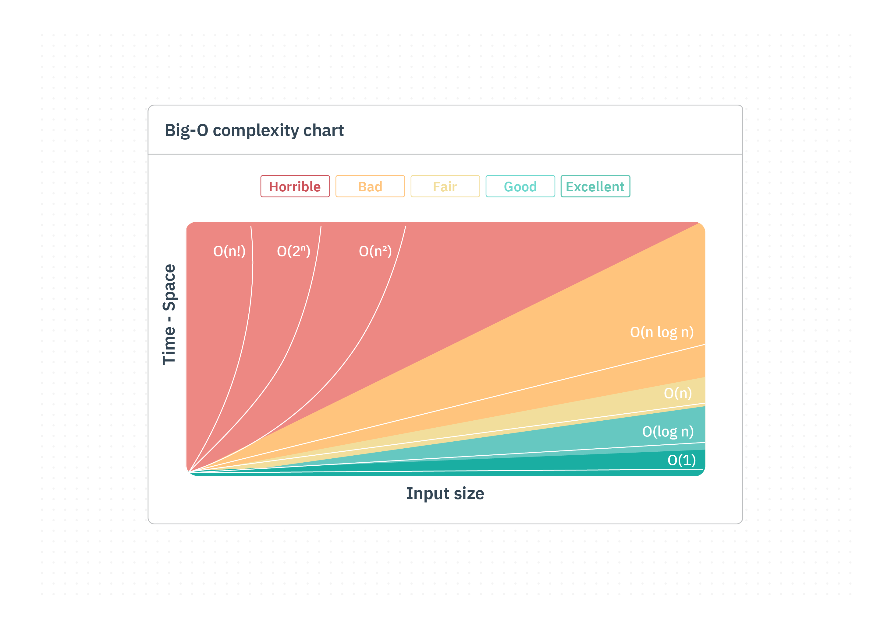

# Introduction to Time and Space Complexity

We know that in order to solve a problem, we need to write an algorithm. But what if we have more than one algorithm to solve the same problem? For example, to sort an array we can use **bubble sort, merge sort**, and so on.

So, once we have more than one algorithm that solves a problem, we need a way to measure the performance of each algorithm and compare them to determine which one is best for a given situation.

This is the **algorithm's efficiency**, and when we say efficiency, we mean **time complexity and space complexity**.


## Concept
**Time complexity** and **space complexity** are the **two main factors that affect the performance** of an algorithm, and **choosing the best algorithm for a given problem is based on them**.

- **Time complexity** is a measure of the **time** an algorithm takes to complete a task, relative to its input size.
- **Space complexity** is a measure of the **memory space** an algorithm needs to complete a task, relative to its input size.

Every computer runs an algorithm at a different speed, because machines have different hardware capabilities. That's why we need a way to measure time and space complexity that is **independent of hardware**. This can be achieved using **Big O notation**.

### Big O notation

**Big O notation** is a **mathematical notation** used to **describe the performance** of an algorithm, it expresses **how its running time or space requirements grow** as the input size grows. By using Big O notation, we can **compare the efficiency** of different algorithms and make informed decisions when optimizing them.

Big O notation is written as `O(f(n))`:
- `f(n)` represents **the growth rate** of the algorithm
- `n` represents the **input size**
- The `O` **symbolizes the upper bound** of the growth rate

It's important to understand that **Big O notation gives an upper bound on the growth rate** of an algorithm. It **focuses on the worst-case scenario**, assuming the algorithm takes the **maximum time or space for any input** of a given size.

>[!NOTE]
> Big O describes the *worst case* (upper bound). Two related notations exist for completeness: **Big Omega (Ω)** describes the *best case* (lower bound), and **Big Theta (Θ)** describes a *tight bound* (when best and worst case grow at the same rate). In this course we focus on Big O, since worst-case performance is what we usually plan for.

>[!NOTE]
> Big O notation **applies to both time and space complexity.**

### The Big O notation complexities

1. `O(1)` **Constant**: The algorithm's **growth rate stays constant**, regardless of input size. An example is a function that checks whether a given number is even; it always does the same fixed amount of work (and uses the same fixed amount of memory), no matter how large the number is.

2. `O(log n)` **Logarithmic**: **The growth rate increases logarithmically as the input size grows**. A classic example is binary search on a sorted array: each recursive call splits the remaining search space in half, so the amount of work needed shrinks quickly as the array grows.

3. `O(n)` **Linear**: **The growth rate increases linearly with the input size**. If the input size doubles, the work roughly doubles too. An example of linear space complexity is a function that creates a new array that is a copy of the input array.

4. `O(n log n)` **Linearithmic**: **The growth rate is proportional to the number of elements multiplied by the logarithm of the number of elements**. For example, the time complexity of merge sort or quicksort (average case).

5. `O(n²)` **Quadratic**: **The growth rate increases quadratically with the input size**. Nested loops over the same input are a typical example of time complexity.

6. `O(2ⁿ)` **Exponential**: **The growth rate increases exponentially with the input size**, meaning the algorithm becomes impractically slow as the input grows even a little. A classic example is the naive recursive implementation of the `Fibonacci` function, which makes two recursive calls at each level of recursion. As `n` grows, the number of recursive calls grows exponentially.

>[!NOTE]
> `Fibonacci` calculates the n-th number in the Fibonacci sequence recursively, where each number is the sum of the two preceding ones, starting from 0 and 1.


The image below illustrates the growth rates of the different Big O complexities:



## Example
Algorithm: Sorting an array using different algorithms

1. Bubble Sort Implementation:
   ```java
   public static void bubbleSort(int[] arr) {
       int n = arr.length;
       for (int i = 0; i < n - 1; i++) {
           for (int j = 0; j < n - i - 1; j++) {
               if (arr[j] > arr[j + 1]) {
                   int temp = arr[j];
                   arr[j] = arr[j + 1];
                   arr[j + 1] = temp;
               }
           }
       }
   }
   ```

   - Time Complexity:
     - In the worst case, the algorithm iterates over the array multiple times, comparing and swapping adjacent elements until it's sorted.
     - As the input size (n) increases, the number of comparisons increases quadratically.
     - Therefore, the **time complexity is `O(n²)`**, where n is the size of the array.

   - Space Complexity:
     - The algorithm uses only a constant amount of extra space (a few temporary variables) regardless of input size.
     - Therefore, **the space complexity is `O(1)`**.

2. Merge Sort Implementation:
   ```java
   public static void mergeSort(int[] arr, int left, int right) {
       if (left < right) {
           int mid = (left + right) / 2;
           mergeSort(arr, left, mid);
           mergeSort(arr, mid + 1, right);
           merge(arr, left, mid, right);
       }
   }

   private static void merge(int[] arr, int left, int mid, int right) {
       int n1 = mid - left + 1;
       int n2 = right - mid;

       int[] leftArr = new int[n1];
       int[] rightArr = new int[n2];

       for (int i = 0; i < n1; i++) {
           leftArr[i] = arr[left + i];
       }
       for (int j = 0; j < n2; j++) {
           rightArr[j] = arr[mid + 1 + j];
       }

       int i = 0, j = 0, k = left;

       while (i < n1 && j < n2) {
           if (leftArr[i] <= rightArr[j]) {
               arr[k] = leftArr[i];
               i++;
           } else {
               arr[k] = rightArr[j];
               j++;
           }
           k++;
       }

       while (i < n1) {
           arr[k] = leftArr[i];
           i++;
           k++;
       }

       while (j < n2) {
           arr[k] = rightArr[j];
           j++;
           k++;
       }
   }
   ```

   - Time Complexity:
     - The array is split in half at each recursive level, giving `O(log n)` levels of recursion.
     - The merge step at each level does `O(n)` work in total across that level.
     - Therefore, the **overall time complexity is `O(n log n)`**.

   - Space Complexity:
     - The merge step allocates temporary arrays whose combined size is `O(n)` at any given time.
     - Therefore, **the space complexity is `O(n)`**.

3. Quick Sort Implementation:
   ```java
   public static void quickSort(int[] arr, int low, int high) {
       if (low < high) {
           int pivotIdx = partition(arr, low, high);
           quickSort(arr, low, pivotIdx - 1);
           quickSort(arr, pivotIdx + 1, high);
       }
   }

   private static int partition(int[] arr, int low, int high) {
       int pivot = arr[high];
       int i = low - 1;
       for (int j = low; j < high; j++) {
           if (arr[j] < pivot) {
               i++;
               int temp = arr[i];
               arr[i] = arr[j];
               arr[j] = temp;
           }
       }
       int temp = arr[i + 1];
       arr[i + 1] = arr[high];
       arr[high] = temp;
       return i + 1;
   }
   ```

   - Time Complexity:
     - The algorithm picks a pivot, partitions the array around it, and recursively sorts the two resulting subarrays.
     - In the worst case (e.g., the pivot is always the smallest or largest element), **the time complexity is `O(n²)`**.

   - Space Complexity:
     - The algorithm sorts in place, using only extra space for the recursive call stack.
     - In the worst case, the recursion depth can reach `O(n)`, so the **space complexity is `O(n)`** in the worst case.


## Practice

Order the following complexities **from fastest (best) to slowest (worst)**:

`O(n²)`, `O(1)`, `O(log n)`, `O(n log n)`, `O(n)`, `O(2ⁿ)`
